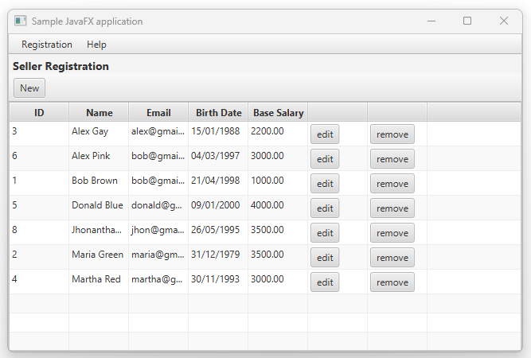

# Sistema de Supermercado

Sistema experimental desenvolvido para prática de aplicação de Design Patterns. O sistema realiza o recuperação, cadastro, alteração, exclusão de Vendedores e Departamentos.

Neste arquivo você encontrará imagens demonstrativas e também tecnologias e conceitos utilizados nesta aplicação.

#### Capturas de tela

[Demo #1](demo/demo_1.png) - [Demo #2](demo/demo_2.png) - [Demo #3](demo/demo_3.png) - [Demo #4](demo/demo_4.png) - [Demo #5](demo/demo_5.png)

## Tecnologias utilizadas

* [JavaFX](https://pt.wikipedia.org/wiki/JavaFX) - Biblioteca Java
* [MySQL](https://www.mysql.com/) - O SGBD adotado
* [MySQLConnector](https://www.mysql.com/products/connector/) - Conector SQL

### Conceitos teóricos aplicados

* [Observer](https://pt.wikipedia.org/wiki/Observer) - Design Pattern
* [Factory Method](https://pt.wikipedia.org/wiki/Factory_Method) - Design Pattern
* [MVC](https://pt.wikipedia.org/wiki/MVC) - Design Pattern
* [DAO](https://pt.wikipedia.org/wiki/Objeto_de_acesso_a_dados) - Design Pattern

## Autor

* Jhonanthan Campos Xavier - [LinkedIn](https://www.linkedin.com/in/jhonanthan-campos-xavier-0905a5141/)

